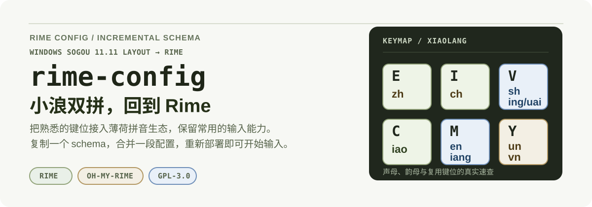
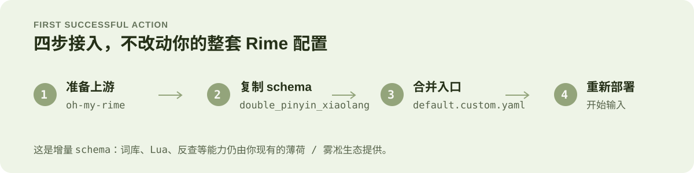
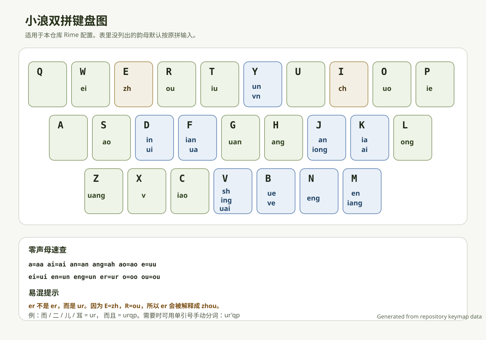

<p align="center">
  
</p>

# 小浪双拼 for Rime

把 Windows 搜狗 11.11 可识别的小浪双拼键位，接入现有的 Rime / 薄荷拼音环境。这个仓库提供的是一个**可叠加的增量 schema**，不是完整的 Rime 整包。

如果你已经安装了 Mintimate 的 [`oh-my-rime`](https://github.com/Mintimate/oh-my-rime)，复制一个 schema、合并一段配置并重新部署，就可以保留原有词库、Lua 和反查能力，直接使用小浪双拼。

## 你会得到什么

- **小浪键位**：迁移声母、韵母和零声母映射，包括 `zh=e`、`ch=i`、`sh=v`。
- **薄荷能力**：继续使用 `rime_mint`、中英混输、Emoji、简繁切换和常用 Lua translators。
- **工具入口**：日期时间、农历、计算器、金额大写、五笔、笔画和拆字反查。
- **可控接入**：只新增 `double_pinyin_xiaolang`，不覆盖你已有的 `default.custom.yaml`。

## 5 分钟接入

### 前置条件

先安装好 [`oh-my-rime`](https://github.com/Mintimate/oh-my-rime)，并确认你的 Rime 用户目录中已有这些上游对象：

```text
rime_mint
melt_eng
wubi98_mint
radical_pinyin
stroke
rime.lua 及其相关 Lua translators / filters
```

### 安装步骤

1. 将 [double_pinyin_xiaolang.schema.yaml](./double_pinyin_xiaolang.schema.yaml) 复制到 Rime 用户目录。
2. 打开自己的 `default.custom.yaml`，把下面的 schema 合并进 `schema_list`：

   ```yaml
   patch:
     schema_list:
       - schema: rime_mint
       - schema: double_pinyin_xiaolang
   ```

   也可以直接参考 [examples/default.custom.yaml](./examples/default.custom.yaml)。不要用示例文件覆盖已有配置。
3. 重新部署 Rime，在方案列表中选择「小浪双拼-薄荷定制」。

<p align="center">
  
</p>

### 常见用户目录

| 平台 | Rime 用户目录 |
| --- | --- |
| macOS Squirrel | `~/Library/Rime` |
| Windows Weasel | `%APPDATA%\\Rime` |
| Linux Fcitx5 Rime | `~/.local/share/fcitx5/rime` |

## 键位速查

下面的键盘图直接来自仓库里的小浪双拼码表。完整解释见 [docs/xiaolang-keymap.md](./docs/xiaolang-keymap.md)。

<p align="center">
  
</p>

### 三组特殊声母

```text
zh = e    ch = i    sh = v
```

其他声母保持原字母。韵母映射以 [double_pinyin_xiaolang.schema.yaml](./double_pinyin_xiaolang.schema.yaml) 为准，表里没有列出的韵母默认按原拼输入。

最容易混淆的几个例子：

| 汉字 / 词 | 编码 | 说明 |
| --- | --- | --- |
| `而`、`二`、`儿`、`耳` | `ur` | 零声母 `er = ur` |
| `小` | `xc` | `x + iao` |
| `两` | `lm` | `l + iang` |
| `正` | `en` | `zh + eng` |
| `谁` | `vd` | `sh + ui` |
| `说` | `vo` | `sh + uo` |
| `怪` | `gv` | `g + uai` |

> `er` 不是 `er`：在这套键位里 `E=zh`、`R=ou`，所以 `er` 会被解释成 `zhou`。零声母 `er` 应输入 `ur`，例如「而且」是 `urqp`；必要时可以写成 `ur'qp` 手动分词。

## 常用能力

### 日期和时间

时间日期引导键默认是 `o`，因此日期时间是 `odt`，而不是 `/dt`。如果希望同时支持 `/dt`、`/rq`、`/sj`，可以在 schema 中将配置改为：

```yaml
key_binder:
  shijian_keys: ["o", "/"]
```

| 输入 | 数字别名 | 功能 |
| --- | --- | --- |
| `orq` | `o77` | 今天日期，包含公历、农历、干支和时辰 |
| `orc` |  | 相对日期查询 |
| `orc3+` / `orc3p` / `orc3=` |  | 3 天后的日期，数字可替换 |
| `orc3-` / `orc3o` |  | 3 天前的日期，数字可替换 |
| `osj` | `o75` | 当前时间 |
| `odt` | `o38` | 当前日期时间 |
| `ott` | `o88` | Unix 秒、毫秒、RFC3339 等时间戳 |
| `outc` |  | 世界时钟 |
| `onl` | `o65` | 农历、干支、节气和时辰 |
| `oxq` | `o97` | 星期和 ISO 周数 |
| `oww` | `o99` | 今年第几周 |
| `ojq` | `o55` | 最近节气和倒计时 |
| `ojr` | `o57` | 即将到来的节日和倒计时 |
| `oday` | `o329` | 日期、农历、年度进度、节日和节气综合信息 |

指定日期不需要 `o` 前缀：

```text
N0101       当前年份的 1 月 1 日
N2026       2026 年 1 月 1 日
N202606     2026 年 6 月 1 日
N20260615   2026 年 6 月 15 日
lunar       今天农历
```

日期不存在时，候选窗口会提示「日期不存在」。日期格式、时间格式和日期时间格式可以直接在 schema 的 `date_formats`、`time_formats`、`datetime_formats` 中调整。

### 计算器和金额转换

计算器使用 `=` 前缀，继承薄荷上游的数学、方程、几何、数列、单位换算和 24 点等函数：

=1+2*3
=(1+2)^3
=sqrt(2)
=sin(pi/2)
=avg(1,2,3,4)
=jzzh(255,10,16)
```

金额转换使用 `R` 前缀：

```text
R1234
R1234.56
```

### 反查和快捷开关

| 输入 / 快捷键 | 功能 |
| --- | --- |
| `Uw...` | 五笔 98 反查 |
| `Ui...` | 笔画反查，笔画键为 `h s p n z` |
| `Uu...` | 拆字反查 |
| `Control+Shift+E` | Emoji 候选开关 |
| `Control+Shift+C` | 拆字滤镜开关 |
| `Control+Shift+1` | 简繁切换 |
| `Control+Shift+exclam` | 兼容部分平台的简繁切换写法 |

符号输入仍由上游 `symbols.yaml` 提供，例如 `/fh` 常用符号、`/jt` 箭头、`/sx` 数学符号和 `/py` 拼音声调字母。

## 已知限制

- 零声母 `en` 和 `eng` 在原始小浪表中同码为 `un`。当前方案默认回显 `en`，但查词时两者都会参与匹配。
- 当前没有加入“小浪专属音形辅码”。没有明确、公开、可验证的规则时，强行复用其他双拼体系的辅码会改变输入行为。
- 这个仓库只提供 schema，不包含 `oh-my-rime` 的词库、Lua 脚本或其他依赖。

## 文件结构

```text
double_pinyin_xiaolang.schema.yaml  # 小浪双拼主方案
examples/default.custom.yaml        # schema_list 接入示例
docs/xiaolang-keymap.md              # 键位说明和易混点
docs/assets/xiaolang-keymap.svg      # SVG 键盘图
docs/assets/xiaolang-keymap.png      # PNG 键盘图
assets/readme/hero.svg               # README 首页视觉
assets/readme/workflow.svg           # 接入流程视觉
```

## 致谢与许可证

本方案基于以下项目和资料整理：

- [Mintimate/oh-my-rime](https://github.com/Mintimate/oh-my-rime)
- [iDvel/rime-ice](https://github.com/iDvel/rime-ice)
- Windows 搜狗 11.11 小浪双拼键位文件
- [Mintimate 安装文档](https://www.mintimate.cc/zh/guide/installRime.html)

schema 沿用了薄荷拼音的组件命名和实现方式。为避免与上游许可证冲突，本仓库采用 [GPL-3.0](./LICENSE)。
